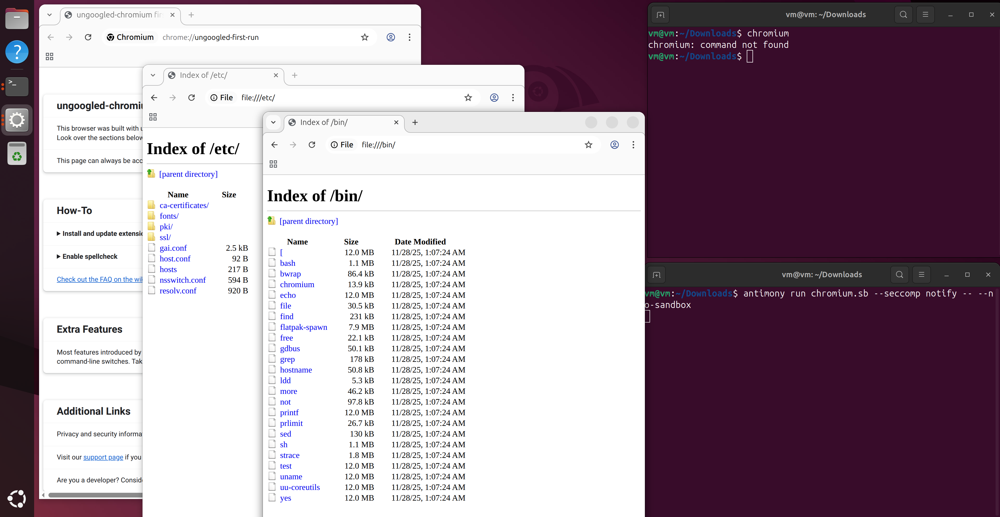

# Antimony



Antimony is a [fast](./docs/Speed.md), [powerful](./docs/Profiles.md), [customizable](./docs/Configurations.md), and [secure](./docs/SECCOMP.md) sandboxing application. It’s dynamic dependency resolution, and extendable design makes it trivial to sandbox applications and seamlessly integrate in the shell and desktop environment.

## Installation
Antimony is available for:
* RPM-Based Distributions (Fedora)
* Debian-Based Distributions (Ubuntu)
* Arch-Based Distributions

Releases provides packages for all three distribution types, which can be installed with your package manager of choice.

Antimony relies on the following runtime-dependencies:
* `glibc`
* `findutils`
* `bubblewrap`
* `strace`
* `xdg-dbus-proxy`
* `sqlite3`
* `libseccomp`
* `libnotify`
* `xdg-open`
* `libdbus`

### Compiling

> [!tip]
> If you’re using Arch, Antimony is available in the [AUR](https://aur.archlinux.org/packages/antimony-sandbox)

To compile Antimony, you will need:
* Rust and Cargo, supporting the 2024 Edition.
* `gcc`
* `libseccomp` (`libseccomp-dev` for Debian)
* `sqlite` (`libsqlite3-dev` for Debian) 
* `pkgconf` (`pkg-config` for Debian)

To build, simply execute `cargo build --release` to generate the required binaries in `target/release`. If you want shell completions, execute `cargo build --release --workspace`, then run the `target/release/antimony_completions`. The completions files will be available in the `completions` folder.
### Packaging

If you want to install Antimony without the help of a package manager, just run the `deploy` script. Otherwise, you can use `fpm` to build a package for your distribution. Simply execute `fpm -t package_type` to output the package.

You’ll need the following dependencies to run the package script:
* `fpm` (Recommended through `gem install fpm`)
* `libarchive` (`libarchive-tools` for Debian)
* `rpm-tools` (`rpm` for Debian)

If you want to install Antimony manually, there are some considerations you take into account:
1. Antimony expects to be run as SetUID underneath its own dedicated system account. You can create one using `useradd -r antimony`. This account should only have access to `/usr/share/antimony`, alongside ownership of the `antimony` binary. You can set the correct permissions on the binary via:
```bash
sudo chown antimony:antimony /usr/bin/antimony
sudo chmod ug+s /usr/bin/antimony
```

>[!note]
>Antimony does not *require* SetUID to function, all that is required is that the `AT_HOME` environment variable points to somewhere it has write access. Note, however, that provided a globally accessible home for Antimony can allowed for trivial sandbox compromise by writing to the sandboxes SOF folder. It also allows erroneous modifications to be made to Profiles and Features without Antimony being able to mediate it.

2.  Antimony creates hard-links from the system library folder (`/usr/lib` and `/usr/lib64`). Some distributions and hardened kernels enforce the `fs.protected_hardlinks` sysctl, which denies this. Antimony should additionally be installed with the `CAP_FOWNER` capability to allow this. You can set it via: `sudo setcap cap_fowner+ep /usr/bin/antimony`.

>[!warning]
>If Antimony cannot create hard links, it will default to copies. This has a drastic toll on performance.

3. You should create a folder for Antimony to store configurations and caches. It defaults to `/usr/share/antimony`.
