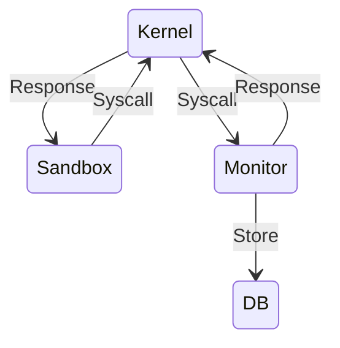
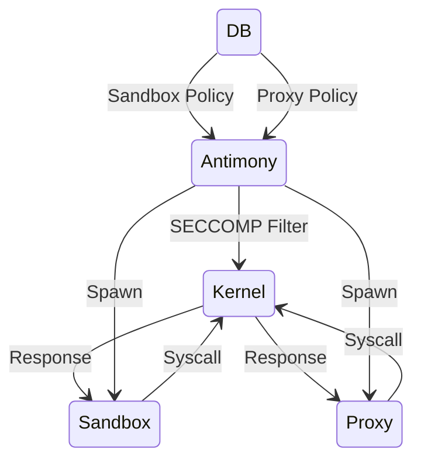
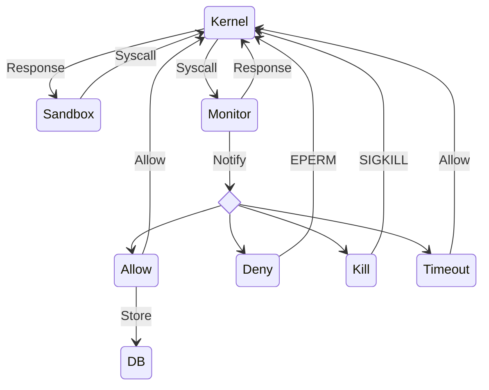

# SECCOMP

SECCOMP is a technology provided by the Linux Kernel that allows for applications to voluntarily restrict the set of syscalls that they can perform, often done immediately proceeding an `exec` call to run another process in this restricted environment.

Antimony provides an SELinux style permission system for managing SECCOMP: In *Permissive* mode, syscalls are logged to generate a profile for the application. In *Enforcing* mode, syscalls not in the profile's policy will be denied.

SECCOMP profiles have two important rules for the purposes of using it within Antimony:
1. Filter’s are initially defined with a *Default* action. This action is applied for any syscall not explicitly outlined in the policy.
2. Each syscall can optionally have a distinct rule applied to it, such as Allow, Kill Process, etc.

The difference between SECCOMP modes in Antimony lies entirely in the first rule: every syscall that has been logged by Antimony will be allowed in either mode. This will become important when initially creating a policy.

## Permissive Mode



To begin creating a SECCOMP Policy for a Profile, you will first need to enable the SECCOMP feature:

```TOML
seccomp = "Permissive"
```

> [!tip]
> You can easily profile all your installed profiles by setting this flag in your [Default Profile](Defaults.md).

When in *Permissive* mode, Antimony will spawn a companion binary alongside the sandbox, `antimony-monitor`. The sandbox will run under a SECCOMP Filter with the *Notify* default action; in this mode, every syscall request from the sandbox (Which includes not only the main application, but any application it spawns within the environment), will be deferred, freezing execution to instead ask the notifying process—in this case `antimony-monitor`.  The monitor will then log this syscall and the application that asked it, and permit the system call to be executed. 

To robustly collect all syscalls, and to account for syscalls that must be exempted in the Permissive filter for the Monitor to function, the monitor executable will hook into the system audit framework (Which you’ll need to enabled, typically via `systemctl enable auditd`). Specifically, the Monitor uses `sendmsg` to send SECCOMP FD across a shared socket. Reading the audit log requires the `CAP_AUDIT_READ` capability, which should be given to the executable. If the capability is not provided, or audit isn’t enabled on the system, you’ll need to manually add the `sendmsg` syscall on relevant profiles.

The Monitor collects two important pieces of information:
1. A list of every application that is run within the sandbox.
2. A list of every syscall used by each of those applications.

By associating a profile with binaries, rather than monolithic syscall policies, policies can be built by coalescing the syscalls for each binary. Binaries used by all the profiles, such as `bwrap`, can be shared, and different operating modes, such as running the profile under `strace` via `antimony trace`, or dropping into a debug shell, do not require an entirely separate policy, instead only adding an additional binary to the policy (Such as `strace` or `sh`).

This information is stored within a SQLite Database stored in `AT_HOME/seccomp`. You can query the information using `antimony info seccomp`, and perform changes via `antimony seccomp`.

> [!warning]
> In *Permissive* mode, any syscalls logged in prior launches will be permitted with the *Allow* action, rather than *Notify*. However, when generating a policy for a new application, ***all*** syscalls will be notified. This can cause noticeable performance loss, but it is only a one-time penalty. You can log an entire system will negligible slowdown as the vast majority of syscalls are logged in the first invocation.
> 

The Monitor is exhaustive, and will collect every syscall used while running, but to ensure all syscalls are logged (Particularly calls that don’t execute consistently, such as getting the time), it’s advised to keep the application in *Permissive* mode for a while. The optimal way to use this mode is:

1. Put the profile in *Permissive* mode.
2. Run the application, then immediately close it. The first time you run the profile in *Permissive* mode, the Monitor needs to approve *every* syscall request (As outline in the preceding warning). The Monitor opts for performance, and will handle the syscalls in a thread pool that can easily consume upwards of 50% of your CPU.
3. Use the profile normally for a day or two. After the first invocation, the vast majority of syscalls will be logged, and subsequently permitted with Allow rather than be approved via the Monitor; performance loss incurred with be negligible.
4. Switch the profile to Enforcing mode.

### SECCOMP Layering

The Kernel allows SECCOMP filters to be stacked, but always in a way that ensures the most secure solution is taken. This manifests itself in two key rules for Antimony’s usage:
1. If a process running underneath an existing SECCOMP Filter attempts to install a *more* restrictive Filter, the Kernel will replace the existing the filter entirely.
2. Unless `NO_NEW_PRIVILEGES` is unset (requiring `CAP_SYS_ADMIN`), the Kernel will not allow a new filter to allow something an existing filter denies.

This presents a problem when Antimony is using SECCOMP with an application that uses SECCOMP itself:
1. When Antimony is in *Permissive* Mode, it is intentionally not restrictive. When the application installs its own Filter to harden a process, it will invariably be more restrictive. The Kernel will then replace Antimony’s Filter with the Application’s Filter; this denies Antimony visibility of any of the subsequent syscalls in that process.
2. When Antimony is in *Enforcing* Mode, and if its default action is more stringent than the one that the application enforces (Such as killing the process), then Antimony’s policy will overrule the application. If that rule is to kill the process, Antimony will kill the application.

These two problems exasperate each other: Antimony cannot log the syscalls used by the application because its Filter is replaced, and when it enforces its policy—a policy missing the syscalls used under the application’s filter—Antimony acts like the syscall is unrecognized—and its higher precedent filter kills the process. 

By leveraging the Notify API, Antimony can resolve this problem; by default, Antimony just logs and allows the syscall to run, but the Notify API is *primarily* meant to execute syscalls outside of the sandboxed environment, and then return the data back to the sandbox. This can also be used to *spoof* values.

When Antimony is provided a request from the Kernel with the `seccomp` or `prctl(PR_SET_SECCOMP)` syscall, it returns a value of 0, but does not instruct the kernel to execute the request. This presents the sandbox with an identical state to as if the SECCOMP filter had been applied, but while leaving Antimony’s filter as the installed policy. It then continues execution under the pretense of running under it’s own policy, but while the Monitor is collecting syscall data. Once the program exits, the Monitor will save the `seccomp` syscall, and any subsequent syscall, and will afterwards be executed with Allow, bypassing the Monitor entirely.

With the syscall now known by Antimony, the application on subsequent runs is free to confine it as it wishes. This improves security considerably, as Antimony can blanket the entire application with an allow-list of syscalls, enforcing a Kill Process action on those that never run during the *Permissive* stage, while the application can then tailor the action of those known syscalls (Such as trapping, returning errors), which would otherwise have been treated identically to an unrecognized syscall.

> [!note]
> The described method deserves security and functional considerations. Pretending that a Filter was applied, while in actuality running under a permissive notifying filter, does reduce the security of the application, but it should be noted that this issue only arises when `seccomp` is not in the SECCOMP Database for the profile (In other words, the first time you run the program in *Permissive* Mode. All other runs, either in *Permissive* or *Enforcing*, simply Allow the syscall, which provides the full security of the Application’s Filter.
> 
> Another consideration is functionality. Chromium/Electron, for example, immediately call a bogus syscall (`fchmod(-1, 07777)`) After invoking the `seccomp` syscall to test that it worked—this is a paranoid test that Antimony has an explicit rule for. However, if your application is equally paranoid, it may panic upon finding a syscall that is supposed to be denied was instead granted, since Antimony merely logs and allows. In such a situation, you may want to consider turning of Antimony’s SECCOMP policy for the profile.

## Enforcing Mode



When a Profile is set to *Enforcing*, Antimony will query the SECCOMP Database to retrieve an allow list for both the Sandbox, and the IPC Proxy if one is used by the former (This is automatically logged by the Monitor in *Permissive* mode). It will then create a Filter that denies any syscall not in the database. Antimony denies syscalls in the most aggressive manner possible—killing the entire offending process. If you have not made a policy for the profile, or it is not exhaustive, this will almost certainly crash the application.

While in *Enforcing* Mode, Antimony will load two filters:
1. The Higher Level filter is applied to Bubblewrap, which includes all syscalls needed for it, and the Profile (As as filter can only be loaded if it is more restrictive). This provides a layer of defense in case of sandbox breach.
2. The Lower Level filter is applied by Bubblewrap itself, as Antimony generates a BPF Filter identical to the High Level, sans Bubblewrap’s Syscalls.

## Notify Mode




In *Notify* Mode, Antimony operates similarly to *Permissive*, but rather than the Monitor allowing and storing all Syscalls encountered, it will ask for the user to make a selection via `notify-send`. This will result in a notification appearing on the user’s Desktop, outlining the Profile and Syscall, with the following options:
1. Allow: The Syscall will be permitted, and stored in the Database (IE subsequent runs will allow this without prompt).
2. Deny: The Syscall will fail with `EPERM`. This decision persists across the instance (IE subsequent runs will request permission for this Syscall)
3. Kill: Send the process that requested the Syscall `SIGKILL`. Then, send `SIGTERM` to the entire process group, gracefully tearing down the sandbox.

If no response is provided to the Notification, Antimony will permit the Syscall, but it will *not* store it in the database. An explicit Allow is required to trust the Syscall for this profile.

>[!warning]
>*Notify* should be used in between *Permissive* and *Enforcing*, where the majority of the Syscalls have already been stored in the former mode. Running a profile in *Notify* mode without any existing filter will send a torrent of notifications, often enough that the Desktop Environment may impose a cooldown.


## The Database

There are two ways of interacting with the SECCOMP Database:
1. `antimony info seccomp` will provide information about the binaries used by a profile, and the syscalls used by a binary.
2. `antimony seccomp` performs actions against the database itself. You can use it to optimize the database, delete it, export it wherever you want, or merge it with another database.


