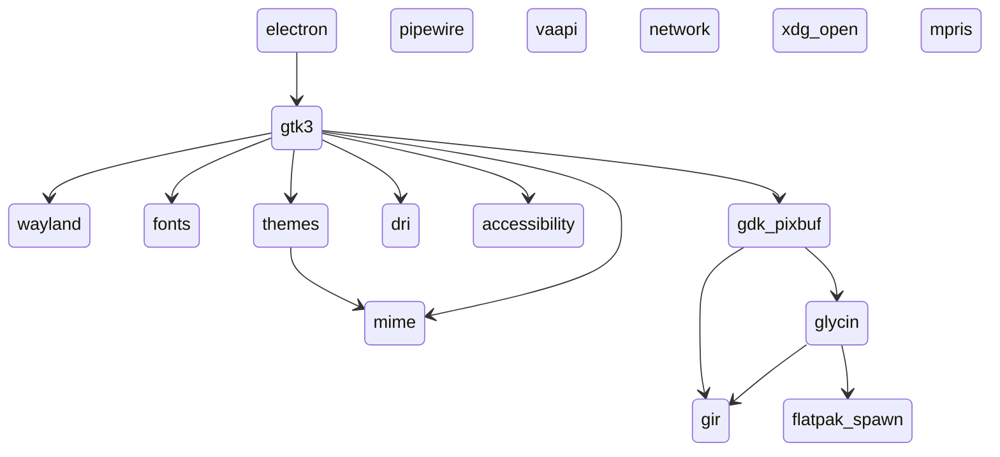

# Features

A Feature is the building block of a Profile. While a Profile defines an *Application*, a Feature defines a particular *System Resource*. For example, if you’re running a GUI application, you’re almost certainly pulling the `wayland` feature:

```toml
name = "wayland"  
description = "Provide the wayland socket."  
libraries.files = ["libwayland*"]  
  
[files]  
resources.ro = ["/usr/share/X11/xkb"]  
user.ro = ["$XDG_RUNTIME_DIR/$WAYLAND_DISPLAY"]  
  
[environment]  
"WAYLAND_DISPLAY" = "$WAYLAND_DISPLAY"  
"XDG_SESSION_TYPE" = "wayland"  
"XDG_CURRENT_DESKTOP" = "$XDG_CURRENT_DESKTOP"  
"DESKTOP_SESSION" = "$DESKTOP_SESSION"
```

However, if you check any such application in the System Store, it almost certainly doesn’t have `wayland` in the `features` list. This is because of Antimony’s greatest strength: Flexibility.

## History

In Antimony’s predecessor, SB, “Profiles” were little more than shell scripts that called the main executable, and Features were hard-coded command line arguments. This proved to be an untenable, inflexible design; new features and modifications to existing features required recompiling the entire program, and presented a considerable security vulnerability in having executable programs in the home-directory of the user. Changing the sandbox was as easy as modifying the `.bashrc`.

It was through this lens that the modern Feature was devised, alongside Profiles more broadly. As TOML documents protected by the `antimony` system user, modification could be mediated. Further, because the logic of a particular feature was written in a plain markup language, the program itself became more of an *engine* that ingested these definitions. Users could easily define new features without having to delve into the source code.

Flexibility was paramount to the Feature, and the Feature Set of an Antimony installation is not so much a collection of disparate definitions as a complicated web of dependencies, conflicts, and an engine that sifts through the mess so that users can define a sandbox with as little effort as possible.

## Dependencies

The fundamental strength of the Feature is that they can rely on other Features through the `requires` field. For example, consider the feature set of Chromium: `features = ["electron", "pipewire", "vaapi", "network", "xdg-open", "mpris"]`. How does that expand? Like this (As of `4.2.0`):


Note that these simply define the dependencies of each feature. The result is that the Chromium definition turns from:

```toml
features = ["pipewire", "vaapi", "xdg-open", "electron", "mpris", "network"]  
inherits = ["default"]  
  
[home]  
name = "chromium"  
policy = "Enabled"  
lock = true  
  
[ipc]  
portals = ["Camera", "FileChooser", "ScreenCast"]  
  
[configuration.clean]  
inherits = ["default"]  
  
[configuration.clean.home]  
policy = "None"
```

Into:

```toml
features = ["electron", "pipewire", "vaapi", "network", "xdg-open", "mpris"]
binaries = ["prlimit", "$AT_HOME/utilities/antimony-spawn=/usr/bin/flatpak-spawn", "ldd", "bwrap", "find", "bash", "$AT_HOME/utilities/antimony-open=/usr/bin/xdg-open"]
libraries = ["libsoftokn3*", "libfreeblpriv3*", "libsmime3*", "libnss*", "gtk-3.0", "tinysparql-3.0", "libgdk-3*", "libgtk-3*", "dri", "gbm", "libMesa*", "libGL*", "libEGL*", "gdk-pixbuf-2.0", "libgdk_pixbuf*", "librsvg-2*", "girepository-1.0", "glycin-loaders", "libglycin*", "libpipewire*", "pipewire-0.3", "spa-0.2", "pulseaudio", "libva-drm*", "libva-wayland*", "libva.so*", "libavcodec*", "libavdevice*", "libavfilter*", "libavformat*", "libavutil*"]
devices = ["/dev/null", "/dev/urandom", "/dev/shm", "/dev/dri"]
namespaces = ["User", "Net"]
arguments = ["--ozone-platform=wayland"]

[home]
policy = "Enabled"
lock = true

[ipc]
portals = ["FileChooser", "Settings", "OpenURI"]
talk = ["org.a11y.Bus", "org.freedesktop.PowerManagement.*"]
own = ["org.mpris.MediaPlayer2.chromium.*"]

[files.user]
ro = ["$HOME/.config/gtkrc", "$HOME/.config/gtkrc-2.0", "$HOME/.config/gtk-2.0", "$HOME/.config/gtk-3.0", "$HOME/.gtkrc-2.0", "/run/user/$UID/wayland-0", "$HOME/.config/fontconfig", "$HOME/.local/share/fontconfig", "$HOME/.local/share/fonts", "$HOME/.fonts", "$HOME/.local/share/pixmaps", "$HOME/.local/share/mime", "$HOME/.config/pulse"]

[files.platform]
ro = ["/etc/xdg/gtk-3.0/", "/usr/share/fonts", "/usr/share/fontconfig", "/etc/fonts", "/usr/share/themes", "/usr/share/color-schemes", "/usr/share/icons", "/usr/share/pixmaps", "/usr/share/cursors", "/usr/share/mime", "/sys/devices/pci0000:00", "/sys/dev/char", "/etc/OpenCL/", "/run/user/$UID/at-spi", "/run/user/$UID/pipewire-0", "/run/user/$UID/pulse", "/etc/pipewire", "/etc/gai.conf", "/etc/host.conf", "/etc/hosts", "/etc/nsswitch.conf", "/etc/resolv.conf", "/etc/ca-certificates", "/etc/pki", "/etc/ssl"]

[files.resources]
ro = ["/usr/share/gtk", "/usr/share/glib-2.0", "/usr/share/gtk-2.0", "/usr/share/gtk-3.0", "/usr/share/X11/xkb", "/usr/share/glvnd", "/usr/share/libdrm", "/usr/share/drirc.d", "/usr/share/gir-1.0/", "/usr/include/glycin-2/", "/usr/include/glycin-gtk4-2/", "/usr/share/glycin-loaders/", "/usr/share/antimony/db/antimony.db", "/usr/share/pipewire", "/usr/share/ca-certificates", "/usr/share/pki", "/usr/share/ssl"]

[environment]
GTK_USE_PORTAL = "1"
GTK_A11Y = "none"
WAYLAND_DISPLAY = "wayland-0"
XDG_SESSION_TYPE = "wayland"
XDG_CURRENT_DESKTOP = "DE"
DESKTOP_SESSION = "/usr/share/wayland-sessions/DE.desktop"
```

The expanded TOML is the necessary logic to confine Chromium, but users do not need to understand that Electron requires GTK3, which itself uses Glycin as an image loader, which itself needs to use `antimony-spawn` to confine its image decoders. All they need to understand is that Chromium is an Electron application (Or, perhaps more accurately, Electron applications are *Chromium* applications).

## Conflicts

Features can also conflict with one another. For example, take `glycin`:

```toml
name = "glycin"
description = "Gnome Image Loading."
requires = ["gir", "flatpak-spawn"]
conflicts = ["hardened_malloc"]

files.resources.ro = [
  "/usr/include/glycin-2/",
  "/usr/include/glycin-gtk4-2/",
  "/usr/share/glycin-loaders/"
]

libraries = [
  "glycin-loaders",
  "libglycin*"
]

binaries = ["prlimit"]
```

Lots of applications don’t like running with `hardened_malloc`. Without Features being able to define this, however, it would be next to impossible to control. If you want to run `chromium` with `hardened_malloc`, do you blacklist `glycin`? What about *its* dependencies? How do we ensure that `flatpak-spawn` is culled as well, since it’s only required by a blacklisted feature? Antimony handles all of that through a rather complicated dance of dependency management.

## Examples

As Features are simply sub-sets of Profiles, they benefit from the latter’s great flexibility. Features that were once hard-coded into Antimony itself have been gradually moved into Features. This includes:

### Debug Shell

```toml
name = "debug-shell"
description = "Drop into a debug shell"

conditional = "command -v /usr/bin/sh"
requires = ["shell"]
binaries = ["sh", "cat", "ls"]
sandbox_args = ["#", "sh", "!"]
```

### Dry Running

```toml
name = "dry"
description = "Immediately exit from the sandbox. This feature is primarily for benchmarking, as you'll usually want to use --dry. This achieves the same thing, but forces the entire sandbox online, including auxiliary binaries, etc."

conditional = "command -v /usr/bin/bash"
binaries = ["/usr/bin/bash"]
sandbox_args = ["#", "/usr/bin/bash", "-c", "exit", "!"]
```

### Stats

```toml
name = "stats"
description = "Compute sandbox statistics"

binaries = ["find", "ls", "wc"]
sandbox_args = ["#", "sh", "-c", """
  echo \"/etc => $(find /etc -type f | wc -l)\";
  for dir in $(ls /etc); do echo \"   $dir => $(find /etc/$dir -type f | wc -l)\"; done;
  for dir in /usr/bin /usr/lib /usr/share; do echo \"$dir => $(find $dir -type f | wc -l)\"; done;
  for dir in $(ls /usr/share); do echo \"    $dir => $(find /usr/share/$dir -type f | wc -l)\"; done;
  """, "!"]
```

### Trace

```toml
name = "trace"
description = "Run the application underneath strace"
conditional = "command -v /usr/bin/strace"
sandbox_args = ["strace", "-ffyY", "-v", "-s", "256"]
binaries = ["strace"]

[hooks.parent]
name = "tracer"
path = "$AT_HOME/utilities/antimony-tracer"
capture_error = true
env = true

```