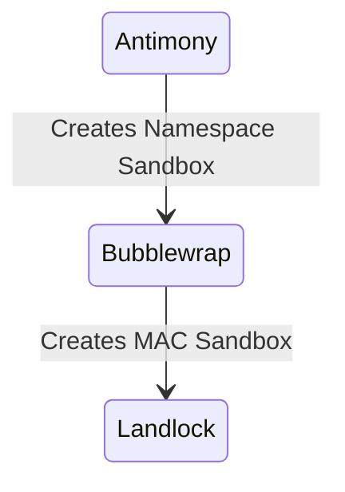

# Landlock

*Landlock* is a [LSM](https://landlock.io/) that provides granular control over how a process is allowed to access file-system and network resources—to a far greater degree than traditional DAC.

Antimony uses Landlock as a means to further strengthen the sandbox barrier as:
1. Landlock is unprivileged, thus it does not require additional permission or capabilities.
2. It provides finer-grained control over how a process can use the resources exposed in the namespace. Particularly:
	1. It enforces which directories the process can execute processes in; by default, Antimony imposes a strict W/X scheme where locations with executable permissions are read-only, and writeable locations cannot also be executable. This means that processes cannot create ad-hoc programs and execute them in the sandbox.
	2. It imposes restrictions on IPC mechanisms, particularly sockets. When no IPC is allowed in the sandbox (i.e no portals, user/system bus), Landlock denies the process from communicating with another process outside the landlock policy; this in effect means the process can only communicate with processes with the same restrictions as itself—denying horizontal movement. For IPC-enabled sandboxes, Landlock imposes which paths can contains such sockets (Such an only permitting `$RUNTIME_DIR`), thus severely restricting the creation of sockets that could be used as a means of sandbox escape.
	3. It enforces R/W access, such that in the case of Namespace escape, the process would be unable to access real system resources that it didn’t already have access to. Particularly, because Antimony uses `/home/antimony` rather than the real user, a namespace escape would entirely prevent access to the user’s home directory.
	4. It provides more granular control over the network, particularly which ports a process is allowed to bind/connect to.

Antimony uses a helper program, `antimony-landlock`, which ingests a markup document detailing the rules of the Landlock policy:




Antimony opportunistically uses Landlock if it’s available, though this has to prerequisites:
1. Your kernel must be build with Landlock support (If you don’t compile it yourself, it almost certainly does)
2. Add `lsm=landlock` to your kernel command line. If `lsm` already exists, simply append `landlock` to the list.

## File Permissions

You can manually adjust file permissions via `files.permissions` in Profiles/Features. It accepts a path, and a `FileMode` such as `ro`, `rw`, and `rx`. Because Landlock rules layer, you can stack them to achieve permissions outside these. For example, if you *do* need `wx`, such as if your application downloads applications to run, you can specify a traditional `rw` mount in `files`, then add an `rx` permission:

```toml
[files.permissions]  
"~/.local/share/zed/extensions" = "rx"
```

>[!note]
>Antimony will create paths that do not exist in the sandbox.

## IPC Permissions

By default, Antimony will enforce appropriate IPC permissions depending on the profile. You need only manually configure it if:

1. You need to bind to a socket for IPC that is not the traditional user/system bus. The `ipc.sockets` field can provide this permission. Because Landlock operates on Paths, you should provide the directory the socket is contained in:

```toml
[ipc] 
sockets = ["/var/run/libvirt"]
```


2. You want more granular control over which ports the sandbox can bind to locally, and connect to remotely. By default, if you do not specify ports, *all* ports will be allowed (With exception, for example, the `network` feature only allows connecting to `443` i.e HTTPS). The `ipc.ports` field provides `bind` and `connect` fields. For example, if you are serving on a specific port, you can enforce that the process cannot bind to any other port:

```toml
features = ["network"]  
arguments = ["--port", "8080"]  
  
[ipc.ports]  
bind = [8080]
```


