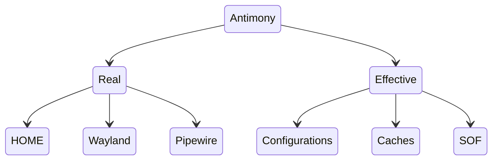

# Lockdown

In Antimony, SetUID is employed specifically as a means to guard particular sets of files from potentially hostile actors on the system. This is a two-way relationship where:

1. The `antimony` user protects Antimony’s configuration and Profile SOFs, ensuring that users cannot illegally modify a profile and leave the configuration store in an invalid state.
2. The running user has personal data in their home and other locations, and is using Antimony to restrict this data and only provide a subset of what is necessary. Utilizing portals, this can be minimized entirely to only provides files on demand.

Antimony inverts the traditional dynamic of SetUID, as the *Real* user (The one running the program) is treated as privileged. The default mode is running as the `antimony` system user (Or *Effective*) and temporarily elevating for reading/opening user files.

Because many profiles require user files, such as the Wayland Socket for graphics, or folders in the user’s Home, Antimony must run the sandbox as the Real User. This is nothing novel—every application you run will run as your user—but given Antimony’s utility in minimizing personal data—there is risk that a potential sandbox escape could provide user-permissions (And access to user data).

Rather than running as the user, Antimony can run the sandbox underneath a dedicated, isolated user: `antimony-sandbox`. This user has no privileges or capabilities, and would have the same permission to user files as any other user. A sufficiently hardened system with `chmod 700` on `$HOME` would block access entirely. Even on regular systems, simply denying write access to the Home folder prevents whole classes of exploits (Such as modifying the `.bashrc`).

There are some significant caveats to consider, however:

1. *No* user files can be directly provided into the sandbox—even if they are globally accessible. Antimony will read each file (i.e. No directories of any kind), and create a copy within the sandbox `ro/rw` defines the permissions on that copy in the Sandbox, but modifications within the sandbox copy will not reflect on the host. This means no:
	1. Directories in `$HOME`
	2. Graphical applications (No access to Wayland)
	3. Sound (No access to Pipewire)
	4. IPC (No access to user bus)
2. `antimony-lockdown` cannot access the typical Home folder in `$XDG_DATA_HOME/antimony`. Instead, homes are created in an isolated folder (`$AT_HOME/lockdown`) that is owned by the Lockdown account.
3. SECCOMP must either be *Disabled* entirely, or set to *Enforcing*. The Monitor must run as the user, and cannot access the process running under a separate user.

Some notes:
1. You *can* create a dedicated folder that the profile can access within your Home by setting the appropriate permissions for a world-accessible directory, and passing it as within `files.resources`. You can further restrict this by giving ownership to `antimony-lockdown:user`. 
2. You can run the profile outside Lockdown in Notifying/Permissive to generate a SECCOMP profile, then switch it to Enforcing with Lockdown.
3. Antimony will politely fail if a Profile tries to run in Lockdown, but can’t.

